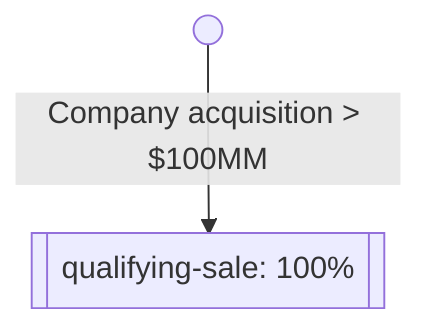
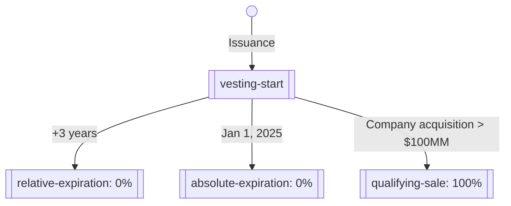

:house: [Documentation Home](../../../README.md)

---

### Object - Vesting Terms

`https://opencaptablecoalition.com/schema/objects/VestingTerms.schema.json`

**Description:** _Object describing the terms under which a security vests_

**Data Type:** `OCF Object - VESTING_TERMS`

**Composed From:**

- [schema/primitives/objects/Object](../primitives/objects/Object.md)

**Properties:**

| Property           | Type                                                                                                                                                                                                                                                                                                                                                                                                                                                                                                                                                                                                                                                                                                                                                                                                                      | Description                                                                     | Required   |
| ------------------ | ------------------------------------------------------------------------------------------------------------------------------------------------------------------------------------------------------------------------------------------------------------------------------------------------------------------------------------------------------------------------------------------------------------------------------------------------------------------------------------------------------------------------------------------------------------------------------------------------------------------------------------------------------------------------------------------------------------------------------------------------------------------------------------------------------------------------- | ------------------------------------------------------------------------------- | ---------- |
| id                 | `STRING`                                                                                                                                                                                                                                                                                                                                                                                                                                                                                                                                                                                                                                                                                                                                                                                                                  | Identifier for the object                                                       | `REQUIRED` |
| comments           | [`STRING`]                                                                                                                                                                                                                                                                                                                                                                                                                                                                                                                                                                                                                                                                                                                                                                                                                | Unstructured text comments related to and stored for the object                 | -          |
| object_type        | **Constant:** `VESTING_TERMS`</br>_Defined in [schema/enums/ObjectType](../enums/ObjectType.md)_                                                                                                                                                                                                                                                                                                                                                                                                                                                                                                                                                                                                                                                                                                                          | Object type field                                                               | `REQUIRED` |
| name               | `STRING`                                                                                                                                                                                                                                                                                                                                                                                                                                                                                                                                                                                                                                                                                                                                                                                                                  | Concise name for the vesting schedule                                           | `REQUIRED` |
| description        | `STRING`                                                                                                                                                                                                                                                                                                                                                                                                                                                                                                                                                                                                                                                                                                                                                                                                                  | Detailed description of the vesting schedule                                    | `REQUIRED` |
| allocation_type    | `Enum - Allocation Type`</br></br>_Description:_ Enumeration of allocation types for vesting terms. Using an example of 18 shares split across 4 tranches, each allocation type results in a different schedule as follows: </br>  1.  Cumulative Rounding (5 - 4 - 5 - 4)</br>  2.  Cumulative Round Down (4 - 5 - 4 - 5)</br>  3.  Front Loaded (5 - 5 - 4 - 4)</br>  4.  Back Loaded (4 - 4 - 5 - 5)</br>  5.  Front Loaded to Single Tranche (6 - 4 - 4 - 4)</br>  6.  Back Loaded to Single Tranche (4 - 4 - 4 - 6)</br>  7.  Fractional (4.5 - 4.5 - 4.5 - 4.5)</br></br>**ONE OF:** </br>&bull; CUMULATIVE_ROUNDING </br>&bull; CUMULATIVE_ROUND_DOWN </br>&bull; FRONT_LOADED </br>&bull; BACK_LOADED </br>&bull; FRONT_LOADED_TO_SINGLE_TRANCHE </br>&bull; BACK_LOADED_TO_SINGLE_TRANCHE </br>&bull; FRACTIONAL | Allocation/rounding type for the vesting schedule                               | `REQUIRED` |
| vesting_conditions | [ [schema/types/vesting/VestingCondition](../types/vesting/VestingCondition.md) ]                                                                                                                                                                                                                                                                                                                                                                                                                                                                                                                                                                                                                                                                                                                                         | Conditions and triggers that describe the graph of vesting schedules and events | `REQUIRED` |

## Explanation

Vesting Terms objects support a structured representation of security
vesting. This is accomplished by expressing security vesting as a graph of
"Vesting Conditions", and then recording vesting transactions on each security.

### Philosophy?

- Graphs should be acylical
- Triggers are the entry point

### Example 1: Event-based vesting

We'll start with a minimal example of event-based vesting. In this scenario,
let's say a Plan Security has been issued but it will not vest _at all_ unless
the company is sold for $100,000,000 or more. We can express this as a graph:



And this graph is expressed in JSON as:

https://github.com/Open-Cap-Table-Coalition/Open-Cap-Format-OCF/blob/77e5085c92484218cb9b5f8c6ca07090a74b93c5/samples/VestingTerms.example1.ocf.json#L4-L26

Let's break down the single [Vesting Condition][condition] here.

1. It has `trigger.type` of `VESTING_EVENT`. This means that this condition
   is not met, and thus this portion of vesting does not occur, until an
   event is triggered and recorded in the transaction log.
2. It has a [Vesting Condition Portion][portion] `portion` of 1/1; in other
   words, 100%.
3. It has an empty array of `next_condition_ids`. This means this is a
   terminating node on the graph and is the end of vesting.

When the security is first issued, we associate it with the Vesting Terms by
ID:

```json
{
  "object_type": "TX_PLAN_SECURITY_ISSUANCE",
  "id": "b1746426",
  "security_id": "vesting-ex-1",
  "date": "2021-01-01",
  "vesting_terms_id": "all-or-nothing",
  "quantity": "500",
  "..."
}
```

If the issuance is the only transaction object on record, then this issuance is 0%
vested. Let's say, however, that a qualifying sale were to occur. To represent
this, we add a [Vesting Event Transaction][event-txn] to the record:

```json
{
  "object_type": "TX_VESTING_EVENT",
  "id": "d0a02b7a",
  "security_id": "vesting-ex-1",
  "date": "2022-07-14",
  "vesting_condition_id": "qualifying-sale"
}
```

This event is linked to the issuance by the `security_id` field, and is linked
to the vesting condition via the `vesting_condition_id`. This means that on 14
July 2022, a vesting event occurred for the referenced security. The amount
vested is derived from:

1. The `quantity` on the security's issuance event.
2. The `portion` on the vesting condition `qualifying-sale`, which is a
   condition on the security's vesting terms `all-or-nothing`.

This is a simple example, but it also probably isn't a very realistic one. In
our next example, we'll show how to add time-based deadlines to an event.

### Example 2: Event-based vesting with deadlines

Let's say that our hypothetical company has realized that the terms described
in Example 1 are not motivating enough, and so they want to add a deadline:

> The security will only vest if the qualifying sale happens within three years
> of issuance, or prior to Jan 1, 2025, whichever happens first.

Our graph is now a little more complicated:



This graph is expressed in JSON as:

https://github.com/Open-Cap-Table-Coalition/Open-Cap-Format-OCF/blob/ea3b6986d4546ca3ac39bbba80ab97cb31945eee/samples/VestingTerms.example2.ocf.json#L4-L66

We're introducing a few new concepts here, so let's tackle them one at a time.

#### Vesting Start

The first condition in our array of vesting conditions has a
[Vesting Start Trigger][start-trigger]. This trigger is essentially a special
case of a Vesting Event, like from our first example. Since it is the first
item in our array of conditions, it is the first node in our graph. Its
occurrence is recorded in the transaction log in the same way as a vesting
event, but as a [Vesting Start Transaction][start-txn]:

```json
{
  "object_type": "TX_VESTING_START",
  "id": "08f8b870",
  "security_id": "vesting-ex-1",
  "date": "2021-01-01",
  "vesting_condition_id": "vesting-start"
}
```

Since our terms said the relative expiration is within three years of issuance,
in this case, the date of our Vesting Start Transaction is the same as our
issuance date. This won't always be the case, as you'll see in other
examples.

#### `next_condition_ids`

Unlike in Example 1, we now have a `next_condition_ids` that is not empty.
These strings are references to the `id` of other vesting conditions, and
indicate the paths we _might_ follow as we navigate our vesting graph. As
time passes, or as events occur, we evaluate the triggers for each possible
"next" condition in the `next_condition_ids` array order.

In this case, after `vesting-start` has been triggered, we have three possible
next conditions:

- `relative-expiration`
- `absolute-expiration`
- `qualifying-sale`

Since the two expirations are date based, one way to think about this is a
daily evaluation:

- If `relative-expiration`'s trigger condition is met,
  goto `relative-expiration` and vest nothing, else:
- If `absolute-expiration`'s trigger condition is met,
  goto `absolute-expiration` and vest nothing, else:
- If `qualifying-sale`'s trigger condition is met,
  goto `qualifying-sale` and vest 100%, else:
- Nothing happens

**Only one path is ever taken,** and graphs should be acylic.

We've already discussed how `qualifying-sale` is triggered in Example 1, but
let's break down the new triggers.

#### Vesting Schedule Relative

Our `relative-expiration` condition has a
[Vesting Schedule Relative Trigger][relative-trigger]. These triggers are
relative to any prior condition that has already been met, as described by
`relative_to_condition_id`.

In this case, the `period` specifies that this condition
triggers 1 time (`occurrences`) after 36 MONTHS (`length` + `type`). Since
`relative_to_condition_id` is `vesting-start`, this means the condition is
triggered 36 months after the Vesting Start transaction. Since the Vesting
Start transaction is dated 1 Jan, 2021, this will trigger 1 Jan, 2024.

Unlike the Vesting Start and Vesting Event triggers, Vesting Schedule
Relative triggers _do not_ have corresponding transactions in the
transaction record. Their triggering is implicit based on the passage of time.

#### Vesting Schedule Absolute

Our `absolute-expiration` condition has a
[Vesting Schedule Absolute Trigger][absolute-trigger]. These triggers are
met at a specific date, regardless of any other vesting event dates in the
transaction log.

In this case, the `date` specifies that this condition would trigger on
1 Jan, 2025. Since that is after the trigger for `relative-expiration`
for this security, it will never happen. If we issued another security
with a later vesting start, however, this trigger could come into play. For
example, with this issuance:

```json
{
  "object_type": "TX_PLAN_SECURITY_ISSUANCE",
  "id": "6174642b",
  "security_id": "vesting-ex-2",
  "date": "2023-07-01",
  "vesting_terms_id": "all-or-nothing-with-expiration",
  "quantity": "500",
  "..."
}
```

and this Vesting Start transaction:

```json
{
  "object_type": "TX_VESTING_START",
  "id": "80f8b807",
  "security_id": "vesting-ex-2",
  "date": "2023-07-01",
  "vesting_condition_id": "vesting-start"
}
```

the `relative-expiration` would not trigger until 1 July, 2026 -- so the
`absolute-expiration` will trigger instead.

Similar to the Vesting Schedule Relative trigger, Vesting Schedule
Absolute triggers _do not_ have corresponding transactions in the
transaction record. Their triggering is implicit based on the passage of time.

#### Quantity vs Portion

You may have also noticed along the way that some of the conditions in this
example have a `quantity` key instead of a `portion` key. All Vesting
Conditions support either a relative `portion` or a fixed `quantity` of shares.

<!-- Supplemental for:
  schema/objects/VestingTerms
-->

#### TODO don't forget to make these relative

[condition]: docs/schema/types/vesting/VestingCondition.md
[start-trigger]: docs/scheam/types/vesting/VestingStartTrigger.md
[relative-trigger]: docs/schema/types/vesting/VestingScheduleRelativeTrigger.md
[relative-trigger]: docs/schema/types/vesting/VestingScheduleAbsoluteTrigger.md
[event-txn]: docs/schema/objects/transactions/vesting/VestingEvent.md
[start-txn]: docs/schema/objects/transactions/vesting/VestingStart.md
[portion]: docs/schema/types/vesting/VestiongConditionPortion.md

```
flowchart TB
id(( ))
start[[vesting-start]]
expired(vesting-expired)
dbl[[double-trigger-acceleration]]
evt1[[twentypct-1]]
evt2[[twentypct-2]]
evt3[[twentypct-3]]
evt4[[twentypct-4]]
evt5[[twentypct-5]]

id-->start
start-->|+4 years|expired
start-->dbl
start-->evt1-->evt2-->evt3-->evt4-->evt5
evt1-->expired
evt2-->expired
evt3-->expired
evt4-->expired
evt1-->dbl
evt2-->dbl
evt3-->dbl
evt4-->dbl
```


**Source Code:** [schema/objects/VestingTerms](../../../../schema/objects/VestingTerms.schema.json)

**Examples:**

```json
[
  {
    "id": "all-or-nothing",
    "object_type": "VESTING_TERMS",
    "name": "Documentation: Example 1",
    "description": "100% of the options vest on a security-specific date",
    "allocation_type": "CUMULATIVE_ROUND_DOWN",
    "vesting_conditions": [
      {
        "id": "qualifying-sale",
        "description": "Company is acquired for > $100MM",
        "portion": {
          "numerator": "1",
          "denominator": "1"
        },
        "trigger": {
          "type": "VESTING_EVENT"
        },
        "next_condition_ids": []
      }
    ]
  },
  {
    "id": "all-or-nothing-with-expiration",
    "object_type": "VESTING_TERMS",
    "name": "Documentation: Example 2",
    "description": "100% of the options vest on a security-specific date, within time boundaries",
    "allocation_type": "CUMULATIVE_ROUND_DOWN",
    "vesting_conditions": [
      {
        "id": "vesting-start",
        "description": "The date on which the vesting period begins",
        "trigger": {
          "type": "VESTING_START_DATE"
        },
        "quantity": "0",
        "next_condition_ids": [
          "relative-expiration",
          "absolute-expiration",
          "qualifying-sale"
        ]
      },
      {
        "id": "relative-expiration",
        "description": "0% vesting three years after vesting start",
        "portion": {
          "numerator": "0",
          "denominator": "1"
        },
        "trigger": {
          "type": "VESTING_SCHEDULE_RELATIVE",
          "period": {
            "length": 36,
            "type": "MONTHS",
            "occurrences": 1,
            "day_of_month": "VESTING_START_DAY_OR_LAST_DAY_OF_MONTH"
          },
          "relative_to_condition_id": "vesting-start"
        },
        "next_condition_ids": []
      },
      {
        "id": "absolute-expiration",
        "description": "0% vesting after 1 Jan, 2025",
        "quantity": "0",
        "trigger": {
          "type": "VESTING_SCHEDULE_ABSOLUTE",
          "date": "2025-01-01"
        },
        "next_condition_ids": []
      },
      {
        "id": "qualifying-sale",
        "description": "Company is acquired for > $100MM",
        "portion": {
          "numerator": "1",
          "denominator": "1"
        },
        "trigger": {
          "type": "VESTING_EVENT"
        },
        "next_condition_ids": []
      }
    ]
  },
  {
    "id": "4yr-1yr-cliff-schedule",
    "object_type": "VESTING_TERMS",
    "name": "Four Year / One Year Cliff",
    "description": "25% of the total number of shares shall vest on the one-year anniversary of this Agreement, and an additional 1/48th of the total number of Shares shall then vest on the corresponding day of each month thereafter, until all of the Shares have been released on the fourth anniversary of this Agreement.",
    "allocation_type": "CUMULATIVE_ROUNDING",
    "vesting_conditions": [
      {
        "id": "vesting-start",
        "quantity": "0",
        "trigger": {
          "type": "VESTING_START_DATE"
        },
        "next_condition_ids": [
          "cliff"
        ]
      },
      {
        "id": "cliff",
        "description": "25% payout at 1 year",
        "portion": {
          "numerator": "12",
          "denominator": "48"
        },
        "trigger": {
          "type": "VESTING_SCHEDULE_RELATIVE",
          "period": {
            "length": 12,
            "type": "MONTHS",
            "occurrences": 1,
            "day_of_month": "VESTING_START_DAY_OR_LAST_DAY_OF_MONTH"
          },
          "relative_to_condition_id": "vesting-start"
        },
        "next_condition_ids": [
          "monthly-thereafter"
        ]
      },
      {
        "id": "monthly-thereafter",
        "description": "1/48th payout each month thereafter",
        "portion": {
          "numerator": "1",
          "denominator": "48"
        },
        "trigger": {
          "type": "VESTING_SCHEDULE_RELATIVE",
          "period": {
            "length": 1,
            "type": "MONTHS",
            "occurrences": 36,
            "day_of_month": "VESTING_START_DAY_OR_LAST_DAY_OF_MONTH"
          },
          "relative_to_condition_id": "cliff"
        },
        "next_condition_ids": []
      }
    ]
  },
  {
    "id": "multi-tranche-event-based",
    "object_type": "VESTING_TERMS",
    "name": "Multi-tranche, event-based with 100%, double-trigger acceleration",
    "description": "20% of the options vest each time a sale is made in excess of $100,000 in the aggregate, so long as such sale is made prior to Noon Eastern 4 years from vesting commencement.",
    "allocation_type": "CUMULATIVE_ROUND_DOWN",
    "vesting_conditions": [
      {
        "id": "vesting-start",
        "quantity": "0",
        "trigger": {
          "type": "VESTING_START_DATE"
        },
        "next_condition_ids": [
          "vesting-expired",
          "double-trigger-acceleration",
          "100k-sale-1"
        ]
      },
      {
        "id": "vesting-expired",
        "quantity": "0",
        "trigger": {
          "type": "VESTING_SCHEDULE_RELATIVE",
          "period": {
            "length": 48,
            "type": "MONTHS",
            "occurrences": 1,
            "day_of_month": "VESTING_START_DAY_OR_LAST_DAY_OF_MONTH"
          },
          "relative_to_condition_id": "vesting-start"
        },
        "next_condition_ids": []
      },
      {
        "id": "double-trigger-acceleration",
        "portion": {
          "numerator": "1",
          "denominator": "1",
          "remainder": true
        },
        "trigger": {
          "type": "VESTING_EVENT"
        },
        "next_condition_ids": []
      },
      {
        "id": "100k-sale-1",
        "portion": {
          "numerator": "20",
          "denominator": "100"
        },
        "trigger": {
          "type": "VESTING_EVENT"
        },
        "next_condition_ids": [
          "vesting-expired",
          "double-trigger-acceleration",
          "100k-sale-2"
        ]
      },
      {
        "id": "100k-sale-2",
        "portion": {
          "numerator": "20",
          "denominator": "100"
        },
        "trigger": {
          "type": "VESTING_EVENT"
        },
        "next_condition_ids": [
          "vesting-expired",
          "double-trigger-acceleration",
          "100k-sale-3"
        ]
      },
      {
        "id": "100k-sale-3",
        "portion": {
          "numerator": "20",
          "denominator": "100"
        },
        "trigger": {
          "type": "VESTING_EVENT"
        },
        "next_condition_ids": [
          "vesting-expired",
          "double-trigger-acceleration",
          "100k-sale-4"
        ]
      },
      {
        "id": "100k-sale-4",
        "portion": {
          "numerator": "20",
          "denominator": "100"
        },
        "trigger": {
          "type": "VESTING_EVENT"
        },
        "next_condition_ids": [
          "vesting-expired",
          "double-trigger-acceleration",
          "100k-sale-5"
        ]
      },
      {
        "id": "100k-sale-5",
        "portion": {
          "numerator": "20",
          "denominator": "100"
        },
        "trigger": {
          "type": "VESTING_EVENT"
        },
        "next_condition_ids": []
      }
    ]
  },
  {
    "id": "custom-vesting-100pct-upfront",
    "object_type": "VESTING_TERMS",
    "name": "Custom terms object specifically for test-plan-security-issuance-full-fields",
    "description": "100% of the options vest on a security-specific date",
    "allocation_type": "CUMULATIVE_ROUND_DOWN",
    "vesting_conditions": [
      {
        "id": "full-vesting",
        "portion": {
          "numerator": "1",
          "denominator": "1"
        },
        "trigger": {
          "type": "VESTING_EVENT"
        },
        "next_condition_ids": []
      }
    ]
  },
  {
    "id": "6-yr-option-back-loaded",
    "object_type": "VESTING_TERMS",
    "name": "Six Year Option - Back Loaded",
    "description": "Grant vests at a rate of 10% of the original number of shares on the 24th month; then vests 1.25% for 12 months; 1.67% for 12 months; 2.08% for 12 months; and 2.5% for 12 months",
    "allocation_type": "BACK_LOADED",
    "vesting_conditions": [
      {
        "id": "vesting-start",
        "quantity": "0",
        "trigger": {
          "type": "VESTING_START_DATE"
        },
        "next_condition_ids": [
          "10pct-after-24-months"
        ]
      },
      {
        "id": "10pct-after-24-months",
        "description": "10% payout at 2 years",
        "portion": {
          "numerator": "1",
          "denominator": "10"
        },
        "trigger": {
          "type": "VESTING_SCHEDULE_RELATIVE",
          "period": {
            "length": 24,
            "type": "MONTHS",
            "occurrences": 1,
            "day_of_month": "VESTING_START_DAY_OR_LAST_DAY_OF_MONTH"
          },
          "relative_to_condition_id": "vesting-start"
        },
        "next_condition_ids": [
          "1.25pct-each-month-for-12-months"
        ]
      },
      {
        "id": "1.25pct-each-month-for-12-months",
        "description": "1.25% payout each month for 12 months",
        "portion": {
          "numerator": "1",
          "denominator": "80"
        },
        "trigger": {
          "type": "VESTING_SCHEDULE_RELATIVE",
          "period": {
            "length": 1,
            "type": "MONTHS",
            "occurrences": 12,
            "day_of_month": "VESTING_START_DAY_OR_LAST_DAY_OF_MONTH"
          },
          "relative_to_condition_id": "10pct-after-24-months"
        },
        "next_condition_ids": [
          "1.67pct-each-month-for-12-months"
        ]
      },
      {
        "id": "1.67pct-each-month-for-12-months",
        "description": "1.67% payout each month for 12 months",
        "portion": {
          "numerator": "1",
          "denominator": "60"
        },
        "trigger": {
          "type": "VESTING_SCHEDULE_RELATIVE",
          "period": {
            "length": 1,
            "type": "MONTHS",
            "occurrences": 12,
            "day_of_month": "VESTING_START_DAY_OR_LAST_DAY_OF_MONTH"
          },
          "relative_to_condition_id": "1.25pct-each-month-for-12-months"
        },
        "next_condition_ids": [
          "2.08pct-each-month-for-12-months"
        ]
      },
      {
        "id": "2.08pct-each-month-for-12-months",
        "description": "2.08% payout each month for 12 months",
        "portion": {
          "numerator": "1",
          "denominator": "48"
        },
        "trigger": {
          "type": "VESTING_SCHEDULE_RELATIVE",
          "period": {
            "length": 1,
            "type": "MONTHS",
            "occurrences": 12,
            "day_of_month": "VESTING_START_DAY_OR_LAST_DAY_OF_MONTH"
          },
          "relative_to_condition_id": "1.67pct-each-month-for-12-months"
        },
        "next_condition_ids": [
          "2.5pct-each-month-for-12-months"
        ]
      },
      {
        "id": "2.5pct-each-month-for-12-months",
        "description": "2.5% payout each month for 12 months",
        "portion": {
          "numerator": "1",
          "denominator": "40"
        },
        "trigger": {
          "type": "VESTING_SCHEDULE_RELATIVE",
          "period": {
            "length": 1,
            "type": "MONTHS",
            "occurrences": 12,
            "day_of_month": "VESTING_START_DAY_OR_LAST_DAY_OF_MONTH"
          },
          "relative_to_condition_id": "2.08pct-each-month-for-12-months"
        },
        "next_condition_ids": []
      }
    ]
  },
  {
    "id": "path-dependent-milestone-vesting",
    "object_type": "VESTING_TERMS",
    "name": "Path-Dependent Milestone Vesting",
    "description": "1. 60% of the shares subject to the Stock Option shall vest and become immediately exercisable upon the FDA’s acceptance of an IND application submitted by the Company relating to the Program; provided, that such acceptance occurs on or before September 30, 2016, and the Warrant Exercise has not occurred prior to such date (the \"Qualified FDA Acceptance\")\n2. Provided that the Warrant Exercise has not occurred, an additional 40% of the Shares subject to this option shall vest and become immediately exercisable upon the closing of an Acquisition (as defined below) of the Company by a third party at a Purchase Price (as defined below)that is equal to or greater than $30,000,000 (a \"Qualified Acquisition\"); provided, that (i) the Qualified FDA Acceptance occurs prior to the closing of such Qualified Acquisition and (ii) the closing of such Qualified Acquisition occurs on or prior to March 31, 2017.",
    "allocation_type": "CUMULATIVE_ROUNDING",
    "vesting_conditions": [
      {
        "id": "vest-start",
        "description": "vesting start date",
        "quantity": "0",
        "trigger": {
          "type": "VESTING_START_DATE"
        },
        "next_condition_ids": [
          "fda-acceptance-deadline-missed",
          "qualified-fda-acceptance"
        ]
      },
      {
        "id": "qualified-fda-acceptance",
        "description": "60% of the shares subject to the Stock Option shall vest and become immediately exercisable upon the FDA’s acceptance of an IND application submitted by the Company relating to the Program; provided, that such acceptance occurs on or before September 30, 2016, and the Warrant Exercise has not occurred prior to such date (the \"Qualified FDA Acceptance\"",
        "portion": {
          "numerator": "60",
          "denominator": "100",
          "remainder": false
        },
        "trigger": {
          "type": "VESTING_EVENT"
        },
        "next_condition_ids": [
          "acquisition-deadline-missed",
          "qualified-acquisition"
        ]
      },
      {
        "id": "qualified-acquisition",
        "description": "Provided that the Warrant Exercise has not occurred, an additional 40% of the Shares subject to this option shall vest and become immediately exercisable upon the closing of an Acquisition (as defined below) of the Company by a third party at a Purchase Price (as defined below)that is equal to or greater than $30,000,000 (a \"Qualified Acquisition\"); provided, that (i) the Qualified FDA Acceptance occurs prior to the closing of such Qualified Acquisition and (ii) the closing of such Qualified Acquisition occurs on or prior to March 31, 2017.",
        "portion": {
          "numerator": "40",
          "denominator": "100",
          "remainder": false
        },
        "trigger": {
          "type": "VESTING_EVENT"
        },
        "next_condition_ids": []
      },
      {
        "id": "fda-acceptance-deadline-missed",
        "description": "Qualified FDA acceptance does not occur on or before September 30, 2016",
        "quantity": "0",
        "trigger": {
          "type": "VESTING_SCHEDULE_ABSOLUTE",
          "date": "2016-10-01"
        },
        "next_condition_ids": []
      },
      {
        "id": "acquisition-deadline-missed",
        "description": "Qualified Acquisition does not occur on or before March 31, 2017",
        "quantity": "0",
        "trigger": {
          "type": "VESTING_SCHEDULE_ABSOLUTE",
          "date": "2017-04-01"
        },
        "next_condition_ids": []
      }
    ]
  }
]
```

Copyright © 2022 Open Cap Table Coalition.
