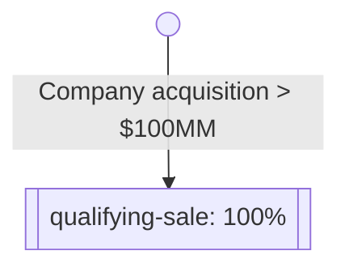
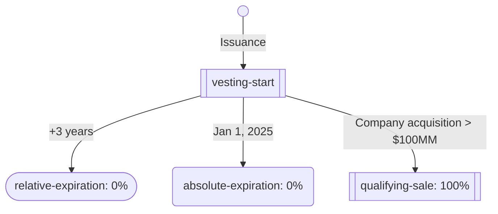
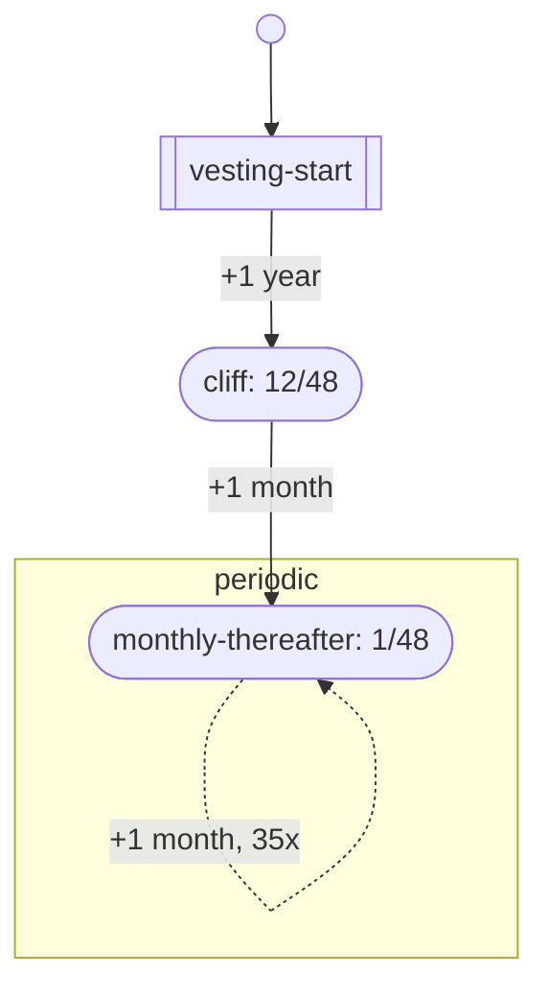

:house: [Documentation Home](../../../../README.md)

---

### Type - Vesting Start Trigger

`https://opencaptablecoalition.com/schema/types/vesting/VestingStartTrigger.schema.json`

_Describes a vesting condition satisfied at the security's vesting commencement date_

**Data Type:** `OCF TYPE`

**Properties:**

| Property | Type                               | Description     | Required   |
| -------- | ---------------------------------- | --------------- | ---------- |
| type     | **Constant:** `VESTING_START_DATE` | Scalar Constant | `REQUIRED` |

## Explanation

Vesting Terms objects support a structured representation of security
vesting. This is accomplished by expressing security vesting as a graph of
"Vesting Conditions", and then recording vesting transactions for each
security.

The current philosophy is that these graphs will be _directed_ and _acyclic_.
Each **condition** (node) in the graph specifies the **trigger** (edge) for
entering that condition, and vesting some **portion** or **quantity** of the
linked security. The conditions also then list all possible subsequent
conditions.

Let's look at some examples.

## Example 1: Event-based vesting

We'll start with a minimal example of event-based vesting. In this scenario,
let's say a Plan Security has been issued but it will not vest _at all_ unless
the company is sold for $100,000,000 or more. We can express this as a graph:



And this graph is expressed in JSON as:

https://github.com/Open-Cap-Table-Coalition/Open-Cap-Format-OCF/blob/77e5085c92484218cb9b5f8c6ca07090a74b93c5/samples/VestingTerms.example1.ocf.json#L4-L26

Let's break down the single [Vesting Condition][condition] here.

1. It has `trigger.type` of `VESTING_EVENT`. This means that this condition
   is not met, and thus this portion of vesting does not occur, until an
   event is triggered and recorded in the transaction log.
2. It has a [Vesting Condition Portion][portion] `portion` of 1/1; in other
   words, 100%.
3. It has an empty array of `next_condition_ids`. This means this is a
   terminating node on the graph and is the end of vesting.

When the security is first issued, we associate it with the Vesting Terms by
ID:

```json
{
  "object_type": "TX_PLAN_SECURITY_ISSUANCE",
  "id": "b1746426",
  "security_id": "vesting-ex-1",
  "date": "2021-01-01",
  "vesting_terms_id": "all-or-nothing",
  "quantity": "500",
  "..."
}
```

If the issuance is the only transaction object on record, then this issuance is 0%
vested. Let's say, however, that a qualifying sale were to occur. To represent
this, we add a [Vesting Event Transaction][event-txn] to the record:

```json
{
  "object_type": "TX_VESTING_EVENT",
  "id": "d0a02b7a",
  "security_id": "vesting-ex-1",
  "date": "2022-07-14",
  "vesting_condition_id": "qualifying-sale"
}
```

This event is linked to the issuance by the `security_id` field, and is linked
to the vesting condition via the `vesting_condition_id`. This means that on 14
July 2022, a vesting event occurred for the referenced security. The amount
vested is derived from:

1. The `quantity` on the security's issuance event.
2. The `portion` on the vesting condition `qualifying-sale`, which is a
   condition on the security's vesting terms `all-or-nothing`.

This is a simple example, but it also probably isn't a very realistic one. In
our next example, we'll show how to add time-based deadlines to an event.

## Example 2: Event-based vesting with deadlines

Let's say that our hypothetical company has realized that the terms described
in Example 1 are not motivating enough, and so they want to add a deadline:

> The security will only vest if the qualifying sale happens within three years
> of issuance, or prior to Jan 1, 2025, whichever happens first.

Our graph is now a little more complicated:



This graph is expressed in JSON as:

https://github.com/Open-Cap-Table-Coalition/Open-Cap-Format-OCF/blob/ea3b6986d4546ca3ac39bbba80ab97cb31945eee/samples/VestingTerms.example2.ocf.json#L4-L66

We're introducing a few new concepts here, so let's tackle them one at a time.

### Vesting Start

The first condition in our array of vesting conditions has a
[Vesting Start Trigger][start-trigger]. This trigger is essentially a special
case of a Vesting Event, like from our first example. Since it is the first
item in our array of conditions, it is the first node in our graph. Its
occurrence is recorded in the transaction log in the same way as a vesting
event, but as a [Vesting Start Transaction][start-txn]:

```json
{
  "object_type": "TX_VESTING_START",
  "id": "08f8b870",
  "security_id": "vesting-ex-1",
  "date": "2021-01-01",
  "vesting_condition_id": "vesting-start"
}
```

Since our terms said the relative expiration is within three years of issuance,
in this case, the date of our Vesting Start Transaction is the same as our
issuance date. This won't always be the case, as you'll see in other
examples.

### `next_condition_ids`

Unlike in Example 1, we now have a `next_condition_ids` that is not empty.
These strings are references to the `id` of other vesting conditions, and
indicate the paths we _might_ follow as we navigate our vesting graph. As
time passes, or as events occur, we evaluate the triggers for each possible
"next" condition in the `next_condition_ids` array order.

In this case, after `vesting-start` has been triggered, we have three possible
next conditions:

- `relative-expiration`
- `absolute-expiration`
- `qualifying-sale`

Since the two expirations are date based, one way to think about this is a
daily evaluation:

- If `relative-expiration`'s trigger condition is met,
  goto `relative-expiration` and vest nothing, else:
- If `absolute-expiration`'s trigger condition is met,
  goto `absolute-expiration` and vest nothing, else:
- If `qualifying-sale`'s trigger condition is met,
  goto `qualifying-sale` and vest 100%, else:
- Nothing happens

**Only one path is ever taken,** and graphs should be acylic.

We've already discussed how `qualifying-sale` is triggered in Example 1, but
let's break down the new triggers.

### Vesting Schedule Relative

Our `relative-expiration` condition has a
[Vesting Schedule Relative Trigger][relative-trigger]. These triggers are
relative to any prior condition that has already been met, as described by
`relative_to_condition_id`.

In this case, the `period` specifies that this condition
triggers 1 time (`occurrences`) after 36 MONTHS (`length` + `type`). Since
`relative_to_condition_id` is `vesting-start`, this means the condition is
triggered 36 months after the Vesting Start transaction. Since the Vesting
Start transaction is dated 1 Jan, 2021, this will trigger 1 Jan, 2024.

Unlike the Vesting Start and Vesting Event triggers, Vesting Schedule
Relative triggers _do not_ have corresponding transactions in the
transaction record. Their triggering is implicit based on the passage of time.

### Vesting Schedule Absolute

Our `absolute-expiration` condition has a
[Vesting Schedule Absolute Trigger][absolute-trigger]. These triggers are
met at a specific date, regardless of any other vesting event dates in the
transaction log.

In this case, the `date` specifies that this condition would trigger on
1 Jan, 2025. Since that is after the trigger for `relative-expiration`
for this security, it will never happen. If we issued another security
with a later vesting start, however, this trigger could come into play. For
example, with this issuance:

```json
{
  "object_type": "TX_PLAN_SECURITY_ISSUANCE",
  "id": "6174642b",
  "security_id": "vesting-ex-2",
  "date": "2023-07-01",
  "vesting_terms_id": "all-or-nothing-with-expiration",
  "quantity": "500",
  "..."
}
```

and this Vesting Start transaction:

```json
{
  "object_type": "TX_VESTING_START",
  "id": "80f8b807",
  "security_id": "vesting-ex-2",
  "date": "2023-07-01",
  "vesting_condition_id": "vesting-start"
}
```

the `relative-expiration` would not trigger until 1 July, 2026 -- so the
`absolute-expiration` will trigger instead.

Similar to the Vesting Schedule Relative trigger, Vesting Schedule
Absolute triggers _do not_ have corresponding transactions in the
transaction record. Their triggering is implicit based on the passage of time.

### Quantity vs Portion

You may have also noticed along the way that some of the conditions in this
example have a `quantity` key instead of a `portion` key. All Vesting
Conditions support either a relative `portion` or a fixed `quantity` of shares.

## Example 3: Schedule-based vesting

A fairly common vesting structure is one that is fully scheduled, with some
kind of delay or "cliff" before any vesting begins. For this example, we'll
construct a set of terms that correspond to four years, vested monthly, with
25% vested at a one year cliff.



And this graph is expressed in JSON as:

https://github.com/Open-Cap-Table-Coalition/Open-Cap-Format-OCF/blob/77e5085c92484218cb9b5f8c6ca07090a74b93c5/samples/VestingTerms.ocf.json#L4-L50

A lot of the concepts used here were introduced in Example 2. A security
associated with this set of Vesting Terms ...

```json
{
  "object_type": "TX_PLAN_SECURITY_ISSUANCE",
  "id": "607e59ab",
  "security_id": "vesting-ex-3",
  "date": "2021-01-01",
  "vesting_terms_id": "4yr-1yr-cliff-schedule",
  "quantity": "480",
  "..."
}
```

... begins vesting when a Vesting Start transaction is logged:

```json
{
  "object_type": "TX_VESTING_START",
  "id": "a32bd9ca",
  "security_id": "vesting-ex-3",
  "date": "2021-01-30",
  "vesting_condition_id": "vesting-start"
}
```

The `vesting-start` condition lists a single `next_condition_id` named "cliff",
which is configured to trigger 12 months after vesting start on 2022-01-31, and
vest 12/48 of the security -- 120 shares. (This portion could just as easily be
25/100, or 1/4; the example only uses the denominator of 48 for consistency.)
Once this condition has triggered, the schedule dictates we wait for the next
condition, "monthly-thereafter", to trigger. This combination of events
introduces us to two new concepts.

### Vesting Schedule Relative `occurrences`

You may have noticed that the visualized graph for this set of vesting terms
appears to have a cycle in it, even though in the introduction we stated that
graphs were acyclic. After the initial trigger of `monthly-thereafter` as we
navigate from the cliff condition, this node appears to trigger itself 35 more
times. The sub-graph and the dashed line in the graph is meant to imply that
this is an internal state of the condition, not a "next" condition. This
repeated triggering is controlled by the `occurrences` attribute.

In this case, occurrences is set to 36, and the portion is set to 1/48. This
means that once this trigger condition is met, it will continue to re-trigger
until it has triggered 36 times total. Each time, 1/48 of the security's
quantity will vest.

### Vesting Day of Month

Both the `cliff` and `monthly-thereafter` conditions in this example specify
a `day_of_month` attribute with the value
`VESTING_START_DAY_OR_LAST_DAY_OF_MONTH`. This attribute is required for
schedule-relative triggers that are specified in months. Possible values are
enumerated [here][day-of-month].

In this case, our value states to use the day of the vesting start transaction
_or_ the last day of the month. This explicit requirement is important to
handle edge cases such as this one, in which the vesting start transaction
occurred on 30 January, 2021.

For our `cliff` condition, the relative time is 12 months. As specified in the
schema, months are calendar months, so this condition triggers on 30 January, 2022.

The `monthly-thereafter` condition, however, uses a relative time of 1 month.
Since there is no day 30 in February, the "or last day of month" logic applies
and the first trigger occurs on 28 February, 2022. This would trigger on 29
February in a leap year as, again, relative months are calendar months.

Each subsequent occurrence of the periodic monthly trigger would apply the same
logic. Since every other month has a day 30, the rest of the occurrences would
occur on the 30th of the month.

If vesting terms are specified using 365-day years, relative triggers should
be expressed in days instead of months.

<!-- Supplemental for:
  schema/objects/VestingTerms
-->

[condition]: ../../../schema_markdown/schema/types/vesting/VestingCondition.md
[start-trigger]: ../../../schema_markdown/schema/types/vesting/VestingStartTrigger.md
[relative-trigger]: ../../../schema_markdown/schema/types/vesting/VestingScheduleRelativeTrigger.md
[relative-trigger]: ../../../schema_markdown/schema/types/vesting/VestingScheduleAbsoluteTrigger.md
[event-txn]: ../../../schema_markdown/schema/objects/transactions/vesting/VestingEvent.md
[start-txn]: ../../../schema_markdown/schema/objects/transactions/vesting/VestingStart.md
[portion]: ../../../../schema_markdown/schema/types/vesting/VestiongConditionPortion.md
[day-of-month]: ../../../schema_markdown/schema/enums/VestingDayOfMonth.md

```
flowchart TB
id(( ))
start[[vesting-start]]
expired(vesting-expired)
dbl[[double-trigger-acceleration]]
evt1[[twentypct-1]]
evt2[[twentypct-2]]
evt3[[twentypct-3]]
evt4[[twentypct-4]]
evt5[[twentypct-5]]

id-->start
start-->|+4 years|expired
start-->dbl
start-->evt1-->evt2-->evt3-->evt4-->evt5
evt1-->expired
evt2-->expired
evt3-->expired
evt4-->expired
evt1-->dbl
evt2-->dbl
evt3-->dbl
evt4-->dbl
```


**Source Code:** [schema/types/vesting/VestingStartTrigger](../../../../../schema/types/vesting/VestingStartTrigger.schema.json)

Copyright © 2022 Open Cap Table Coalition.
