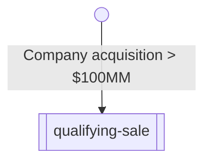

## Explanation

Vesting Terms objects support a structured representation of security
vesting. This is accomplished by expressing security vesting as a graph of
"Vesting Conditions", and then recording vesting transactions on each security.

### Philosophy?

- Graphs should be acylical
- Triggers are the entry point

### Example 1: Event-based vesting

We'll start with a minimal example of event-based vesting. In this scenario,
let's say a Warrant has been issued but it will not vest _at all_ unless the
company is sold for $100,000,000 or more. In graph form:



https://github.com/Open-Cap-Table-Coalition/Open-Cap-Format-OCF/blob/77e5085c92484218cb9b5f8c6ca07090a74b93c5/samples/VestingTerms.example1.ocf.json#L1-L26

<!-- Supplemental for:
  schema/objects/VestingTerms
-->

```
flowchart TB
id(( ))
start[[vesting-start]]
expired(vesting-expired)
dbl[[double-trigger-acceleration]]
evt1[[twentypct-1]]
evt2[[twentypct-2]]
evt3[[twentypct-3]]
evt4[[twentypct-4]]
evt5[[twentypct-5]]

id-->start
start-->|+4 years|expired
start-->dbl
start-->evt1-->evt2-->evt3-->evt4-->evt5
evt1-->expired
evt2-->expired
evt3-->expired
evt4-->expired
evt1-->dbl
evt2-->dbl
evt3-->dbl
evt4-->dbl
```
