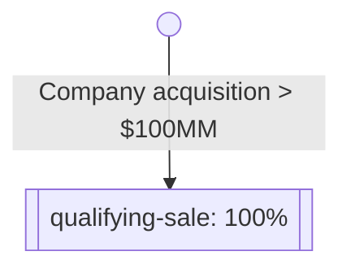

## Explanation

Vesting Terms objects support a structured representation of security
vesting. This is accomplished by expressing security vesting as a graph of
"Vesting Conditions", and then recording vesting transactions on each security.

### Philosophy?

- Graphs should be acylical
- Triggers are the entry point

### Example 1: Event-based vesting

We'll start with a minimal example of event-based vesting. In this scenario,
let's say a Warrant has been issued but it will not vest _at all_ unless the
company is sold for $100,000,000 or more. We can express this as a graph:



And this graph is expressed in JSON as:

https://github.com/Open-Cap-Table-Coalition/Open-Cap-Format-OCF/blob/77e5085c92484218cb9b5f8c6ca07090a74b93c5/samples/VestingTerms.example1.ocf.json#L4-L26

Let's break down the single [Vesting Condition][condition] here.

1. It has `trigger.type` of `VESTING_EVENT`. This means that this condition
   is not met, and thus this portion of vesting does not occur, until an
   event is triggered and recorded in the transaction log.
2. It has a [Vesting Condition Portion][portion] `portion` of 1/1; in other
   words, 100%.
3. It has an empty array of `next_condition_ids`. This means this is a
   terminating node on the graph and is the end of vesting.

When the warrant is first issued, we associate it with the Vesting Terms by
ID:

```json
{
  "object_type": "TX_WARRANT_ISSUANCE",
  "id": "b1746426",
  "security_id": "vesting-ex-1",
  "date": "2021-01-01",
  "vesting_terms_id": "all-or-nothing",
  "quantity": "500",
  "..."
}
```

If this is the only transaction object on record for, then this issuance is 0%
vested. Let's say, however, that a qualifying sale were to occur. To represent
this, we add a [Vesting Event Transaction][event-txn] to the record:

```json
{
  "object_type": "TX_VESTING_EVENT",
  "id": "d0a02b7a",
  "security_id": "vesting-ex-1",
  "date": "2022-07-14",
  "vesting_condition_id": "qualifying-sale"
}
```

This event is linked to the issuance by the `security_id` field, and is linked
to the vesting condition via the `vesting_condition_id`. This means that on 14
July 2022, a vesting event occured for the referenced security. The amount
vested is derived from:

1. The `quantity` on the security's issuance event.
2. The `portion` on the vesting condition `qualifying-sale`, which is a
   condition on the security's vesting terms `all-or-nothing`.

<!-- Supplemental for:
  schema/objects/VestingTerms
-->

[condition]: docs/schema/types/vesting/VestingCondition.md
[event-txn]: docs/schema/objects/transactions/vesting/VestingEvent.md
[portion]: docs/schema/types/vesting/VestiongConditionPortion.md

```
flowchart TB
id(( ))
start[[vesting-start]]
expired(vesting-expired)
dbl[[double-trigger-acceleration]]
evt1[[twentypct-1]]
evt2[[twentypct-2]]
evt3[[twentypct-3]]
evt4[[twentypct-4]]
evt5[[twentypct-5]]

id-->start
start-->|+4 years|expired
start-->dbl
start-->evt1-->evt2-->evt3-->evt4-->evt5
evt1-->expired
evt2-->expired
evt3-->expired
evt4-->expired
evt1-->dbl
evt2-->dbl
evt3-->dbl
evt4-->dbl
```
